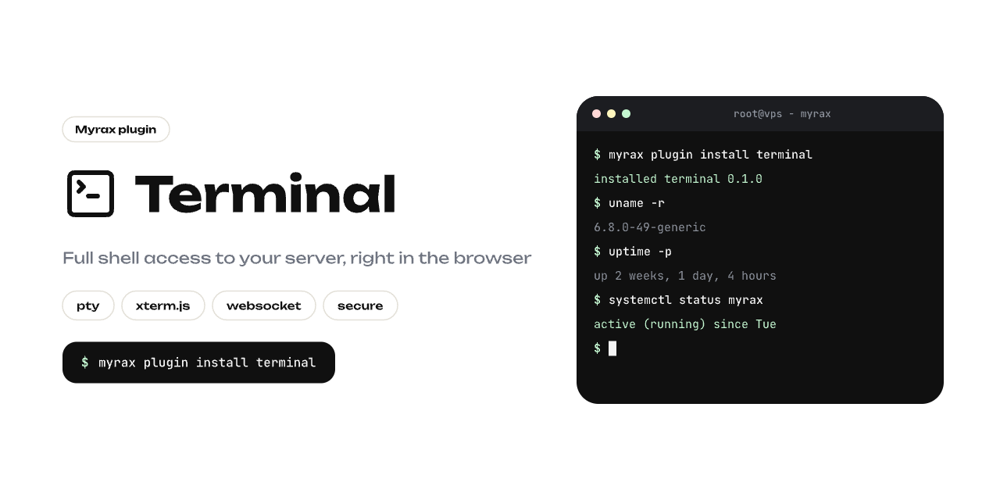

# Terminal Plugin

Web terminal for Myrax. Black and white, xterm.js under the hood.

## Install

```sh
myrax add-ons enable
myrax plugin install https://github.com/Myrax-panel/terminal-plugin
```

## Runtime

Uses built-in Myrax terminal runtime, connects over WebSocket.

```text
GET /health
WS  /terminal
```

Panel connects through `/api/plugins/terminal/ws/terminal`.
